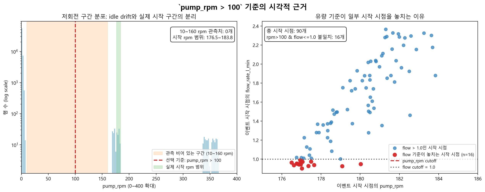

# H2 분석 설계 고정 문서

## 문서 목적

이 문서는 최종 가설검정 코드를 작성하기 전에 H2 분석 설계를 미리 고정해두기 위한 내부 기준 문서입니다.

중요한 점은 다음과 같습니다.

- 이 문서는 외부 등록용 공식 preregistration 문서가 아니라, 현재 프로젝트 안에서 분석 기준을 합의하고 고정하기 위한 작업 문서입니다.
- H2는 **막힘(clogging)의 인과를 직접 증명하는 분석**으로 해석하지 않습니다.
- 현재 데이터로 H2가 직접 뒷받침할 수 있는 것은 다음 두 가지입니다.
  - `drain_ec` 기반 반응 지연(lag)이 시간 또는 반복 이벤트에 따라 변하는지
  - 그 방향성이 구역별 배지 신호와 일관적인지
- 반대로 다음은 현재 데이터만으로 분리해서 증명할 수 없습니다.
  - 생육 단계 변화
  - 계절 또는 기상 변화
  - 운영 정책 변화
  - 위 요소들과 막힘 효과를 완전히 분리한 순수 인과 효과

## 0단계 진단

원본 데이터:

- `human_A/src/selected_smartfarm.csv`

주의:

- 아래의 `pump_rpm > 100` 기준은 `modeling_stronger_jun.ipynb`에서 직접 가져온 규칙이 아닙니다.
- 이 기준은 `selected_smartfarm.csv`를 기준으로 이벤트 정의를 다시 점검하는 과정에서 따로 정한 것입니다.

### 점검 1. `drain_ec_ds_m` 갱신 주기

결과:

- 연속 동일값(run length) 분위수
  - 중앙값: `1분`
  - p95: `2분`
  - p99: `4분`
  - p99.9: `11분`
- 소수 셋째 자리 반올림 후에도 run length 결과는 동일했습니다.

판단:

- 유효 갱신 단위 `K = 1분`

의미:

- 이후 노이즈 기준과 lag 탐지는 1분 원시 시계열을 기준으로 정의합니다.

### 점검 2. 이벤트 정의와 고립 이벤트 수

후보 `pump_on` 기준:

- `pump_rpm > 100`

임계값 근거:

- 이 값은 정밀하게 튜닝한 cutoff가 아니라, 이 데이터에서 off 구간과 실제 on 구간 사이의 **빈 분리 구간** 안에 놓인 보수적 경계입니다.
- 비가동 구간에서도 `pump_rpm`은 정확한 0으로만 머무르지 않고 대체로 `0~2 rpm` 부근의 작은 drift를 보입니다.
- 그래서 `> 0` 또는 `> 1` 같은 기준은 지나치게 느슨합니다.
- 반대로 실제 on 시작 시점의 `pump_rpm`은 이미 `176.5~183.8 rpm` 범위에 들어갑니다.
  - 시작 시점 중앙값: `about 179.8 rpm`
- 데이터상 `10 < pump_rpm <= 160` 구간에는 관측치가 없었습니다.
- 따라서 `10/20/30/50/75/100/125/150/160` 어떤 기준을 써도 같은 분할이 나왔습니다.
  - on 행 수: `65,610`
  - 시작 횟수: `90`
  - on 블록이 존재하는 날짜 수: `90`
- 즉 `100`은 물리적으로 특별한 숫자라서가 아니라, **idle drift는 배제하면서 실제 on 구간은 안정적으로 포착하는 빈 구간 내부의 대표값**으로 선택한 것입니다.

왜 유량 기준을 쓰지 않았는가:

- `flow_rate_l_min > 1.0` 같은 유량 기준은 실제 시작 직후 몇 분을 놓칩니다.
- `pump_rpm > 100`과 `flow_rate_l_min > 1.0`을 비교하면 불일치 행이 `16`개 있었습니다.
- 그 불일치 시점에서는 `pump_rpm`이 이미 `176~180 rpm` 정도로 명확한 on 상태인데, `flow_rate_l_min`은 아직 `0.902~0.987` 수준이었습니다.
- 즉 유량보다 `pump_rpm`이 기계적 시작 시점을 더 빠르고 일관되게 포착합니다.

시각적 근거:

그림 해석:

- 왼쪽 패널은 저회전 구간을 확대해 본 것입니다.
- `0~2 rpm` 부근에는 비가동 상태의 작은 drift가 많이 보이지만, 실제 시작 시점은 `176~184 rpm`에 모여 있습니다.
- 그 사이 `10~160 rpm` 구간은 사실상 비어 있으므로, `100`은 그 빈 분리 구간 안에 놓인 보수적 경계입니다.
- 오른쪽 패널은 이벤트 시작 시점만 뽑아 `pump_rpm`과 `flow_rate_l_min`을 함께 본 것입니다.
- 총 `90`개 시작 중 `16`개는 `pump_rpm > 100`이지만 `flow_rate_l_min <= 1.0`이라서, 유량 기준만 쓰면 실제 기계적 시작 일부를 놓치게 됩니다.
- 그림 생성 코드는 [make_pump_threshold_figure.py](make_pump_threshold_figure.py)에 저장해 두었습니다.

관찰된 구조:

- `pump_rpm > 100`이면 시작 횟수는 `90`
- 날짜당 정확히 `1회` 시작
- 시작 시각은 고정적으로 `05:51`
- 가동 블록 길이는 약 `729분`
- 비가동 블록 길이는 약 `711분`

고립성(isolation) 검사:

- 시작 전 off 윈도우 `30/60/120분`
- 시작 후 on 윈도우 `30/60/120분`
- 모든 조합에서 고립 이벤트 수는 `90/90`으로 유지되었습니다.

판단:

- 이벤트는 `pump_rpm > 100`으로 정의한 일일 공급 블록 시작 시점으로 둡니다.
- 이유:
  - 저속 idle drift를 제외할 수 있음
  - off/on 사이 빈 분리 구간 안에 위치함
  - `flow_rate_l_min > 1.0`보다 더 이른 기계적 시작을 보존함
- 고립 이벤트 규칙:
  - 이전 `60분`은 모두 off
  - 이후 `60분`은 모두 on

통과 기준:

- 최소 이벤트 수 `>= 30`
- 최소 고립 이벤트 비율 `>= 10%`

결과:

- PASS (`90` events, `100%` isolated ratio)

### 점검 3. `drain_ec` 노이즈 분포

노이즈 표본:

- 비가동 구간(`pump_rpm <= 100`)에서의 `|diff(drain_ec_ds_m)|`

관찰된 분포:

- 중앙값: `0.002`
- p90: `0.006`
- p95: `0.007`
- p99: `0.009`
- 왜도: `0.919`
- 첨도: `0.802`

임계값 비교:

- `3 * sigma = 0.006327`
- `3 * 1.4826 * MAD = 0.004448`

판단:

- 강건한(robust) 임계값 계열을 사용합니다.
- 유의한 `drain_ec` 변화는 다음으로 정의합니다.
  - `|diff(drain_ec_ds_m)| > 3 * 1.4826 * MAD(inactive baseline)`

이유:

- 분포가 비대칭이어서 고정 `3σ` 기준은 이벤트 탐지에 불안정합니다.

### 점검 4. 이벤트 lag 탐지 실패율

탐지 규칙:

- 각 이벤트 시작 시점 `t_i`에 대해
- `t_i` 이후 `0~60분` 구간에서
- `|diff(drain_ec_ds_m)|`가 고정된 임계값을 처음 넘는 시점을 찾습니다.

실패율 비교:

- `3σ` 임계값
  - 탐지: `28`
  - 실패: `62`
  - 실패율: `68.9%`
  - FAIL
- `MAD` 임계값
  - 탐지: `70`
  - 실패: `20`
  - 실패율: `22.2%`
  - PASS

통과 기준:

- 실패율 `<= 30%`

판단:

- 검출 실패 이벤트도 censoring으로 유지합니다.
- 실패한 이벤트를 메인 분석표에서 제거하지 않습니다.

### 점검 5. 구역별 보조 신호 사용 가능성

같은 이벤트 시작 시점을 사용하고, 각 구역 신호에도 강건한 MAD 기준을 적용했을 때:

- `zone1_substrate_moisture_pct`: 실패율 `8.9%`
- `zone2_substrate_moisture_pct`: 실패율 `18.9%`
- `zone3_substrate_moisture_pct`: 실패율 `18.9%`
- `zone1_substrate_ec_ds_m`: 실패율 `13.3%`
- `zone2_substrate_ec_ds_m`: 실패율 `22.2%`
- `zone3_substrate_ec_ds_m`: 실패율 `35.6%`

통과 기준:

- 최소 한 개 이상의 보조 구역 신호가 분석 가능해야 함

결과:

- PASS

## 고정된 H2 분석 설계

### 메인 신호

- 이벤트 시작:
  - `pump_rpm > 100`
  - off에서 on으로 전이되는 시점
- 메인 반응 신호:
  - `|diff(drain_ec_ds_m)|`
- 탐지 창:
  - `0~60분`

### 이벤트 lag 정의

각 이벤트 시작 시점 `t_i`에 대해:

- `60분` 이내에서 다음 조건을 처음 만족하는 시점 `t`를 찾습니다.
  - `|diff(drain_ec_ds_m)| > 3 * 1.4826 * MAD(inactive baseline)`
- 그리고
  - `lag_i = t - t_i`
- 만약 이런 `t`가 없으면
  - 해당 이벤트는 right-censored로 둡니다.

### 시간 축

메인 분석 축:

- 누적 이벤트 인덱스 (`1..90`)

중요한 한계:

- 이 데이터에서는 이벤트 인덱스와 운영 날짜가 사실상 같은 축입니다.
- 따라서 `event count vs day`는 독립적인 강건성 검사가 아닙니다.
- 달력 시간 효과와 반복 공급 효과를 분리해서 식별할 수 없습니다.
- 시간 추세 결과는 고유한 clogging 효과라기보다, 시간과 운영이 섞인 패턴으로 해석해야 합니다.

### censoring을 유지하는 메인 모형

주요 추론 모형:

- Cox proportional hazards model
- outcome:
  - 첫 유의 반응까지의 시간
- censoring:
  - `60분`에서 right-censored
- main covariate:
  - 누적 이벤트 인덱스

이유:

- censoring을 유지해야 함
- 가설의 핵심은 반복 이벤트에 따라 반응 시점이 변하는지에 있음
- 추후 방어 가능한 통제변수가 생기면 Cox 모형에 추가 가능함

보조 시각화:

- early vs late 이벤트의 Kaplan-Meier 곡선
- 단, 이는 확인적(confirmatory) 검정이 아니라 기술적(descriptive) 비교에 한정함

추가 메모:

- uncensored-only 보조 회귀를 보고할 경우, 인접 이벤트 간 시간 상관을 고려해 HAC / Newey-West 계열 표준오차를 사용해야 합니다.

### 시작 시점 탐지 규칙

기본 반응 신호:

- `abs(diff(drain_ec_ds_m))`

고정된 onset 규칙:

- `0~60분` 창 안에서
- 반응 신호가 고정 임계값을 넘는 첫 시점을 onset으로 정의하되
- 그 상태가 최소 `2개`의 연속된 1분 샘플에서 유지되어야 합니다.

이유:

- 단발성 센서 스파이크에 과민하게 반응하지 않기 위함입니다.

경계 점검:

- 구현 시 `60분` 정확히 경계에서 검출된 비율을 반드시 보고해야 합니다.
- 오른쪽 경계에 검출이 과도하게 몰리면 boundary artifact 가능성을 해석에 명시해야 합니다.

### 결론 강도

허용되는 주장:

- 반복 공급 이벤트에 따라 `drain_ec` 반응 lag가 변한다
- 그리고 그 방향성과 일관성을 구역별 배지 신호와 비교할 수 있다

허용되지 않는 주장:

- lag 패턴의 원인이 clogging이라고 직접 증명하는 것
- drain flow onset을 직접 증명하는 것
- `channeling`과 `clogging`을 같은 방향 가설로 섞어 쓰는 것

## 구현 전 고정된 기준값

다음 값들은 구현 전에 고정합니다.

- 유효 cadence `K = 1분`
- 이벤트 정의: `pump_rpm > 100`
- 고립 규칙:
  - 사전 off `60분`
  - 사후 on `60분`
- 반응 창 `tau_max = 60분`
- 유의 변화 임계값:
  - `3 * 1.4826 * MAD`
- 최소 이벤트 수 `>= 30`
- 최소 고립 이벤트 비율 `>= 10%`
- 최대 실패율 `<= 30%`
- 최소 한 개 이상의 보조 구역 신호 통과
- onset 확인:
  - 임계값 초과가 연속 `2개` 샘플 유지
- 메인 추론 모형:
  - Cox proportional hazards

## 해석 규칙 고정

- H2는 **이벤트-반응 lag 분석**이지, 연속시간 CCF 기반 직접 증명 분석이 아닙니다.
- CCF를 나중에 넣더라도 보조 분석으로만 사용합니다.
- censoring된 이벤트도 분석에서 유지합니다.
- 이 데이터에서는 calendar time과 cumulative event exposure를 분리할 수 없습니다.
- 만약 구현 과정에서 위 값 중 하나라도 바꿔야 한다면, 코드보다 먼저 이 문서를 수정해야 합니다.
